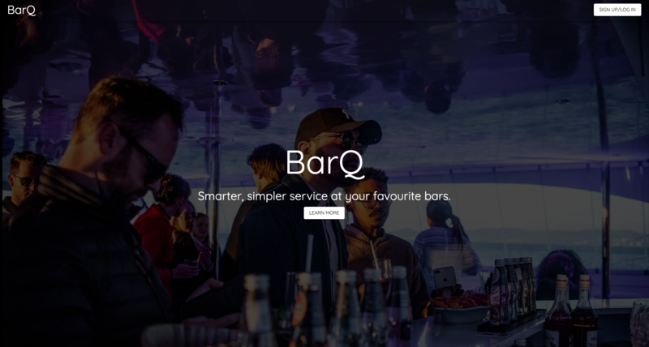
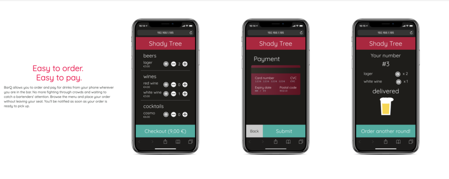
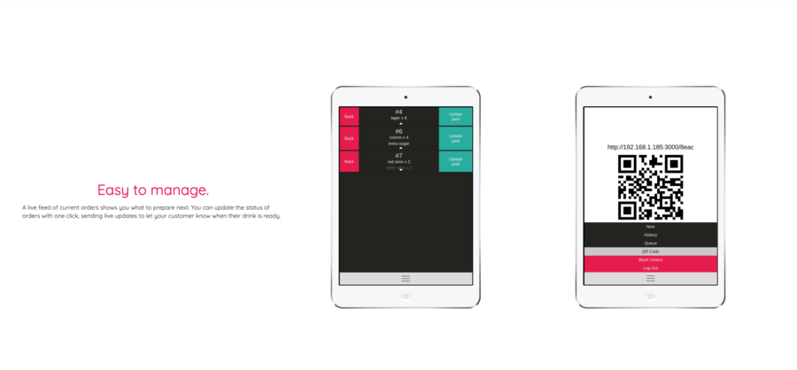

# BarQ Client

# BarQ
## Brief description (600 words max)

## screenshots (Copy from landing page)
BarQ allows you to order and pay for drinks from your phone wherever you are in the bar. No more fighting through crowds and waiting to catch a bartenders' attention. Browse the menu and place your order without leaving your seat. You’ll be notified as soon as your order is ready to pick up.

Landing Page

BarQ provides a user friendly interface for bar owners to manage different menus across multiple bars, all in one place.

A live feed of current orders shows you what to prepare next. You can update the status of orders with one click, sending live updates to let your customer know when their drink is ready.

      

## Getting Started
Each of the interfaces (Customer, Staff, and Admin) are a separate React app and expect to connect with the [BarQ Server] (https://github.com/felixweinberger/barq-server).

Steps:
1. Rename the .env.example files in /customer and /staff to .env and fill in necessary fields
2. Run BarQ server with docker-compose (check the [BarQ server repository] (https://github.com/felixweinberger/barq-server) for further details).
3. Double check that the BarQ server directory is named "barq-server" (this is to ensure that the front-end finds the correct docker network)
4. In the Barq-Client directory, run docker-compose build
5. In the Barq-Client directory, run docker-compose up

# Tech Stack
## Customer (Alan)
- React
- Redux
- Axios
- Socket.io-client

## Staff (Natalia)
## Admin (Egill)

# Contributors
- Natalia Rizzi
- Egill Hreinsson
- Alan Hu
- Felix Weinberger
- Rachel Bonny
